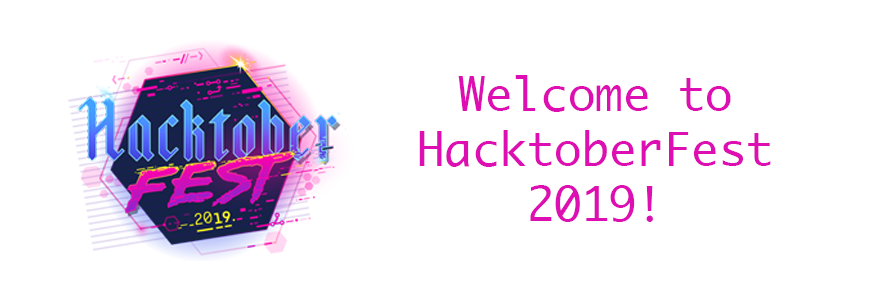

# 

&nbsp; [](https://app.netlify.com/sites/mentors/deploys)&nbsp; [](https://GitHub.com/Naereen/StrapDown.js/graphs/commit-activity)&nbsp; [](https://GitHub.com/Naereen/)&nbsp; [](https://forthebadge.com)

Coding-AI helps to find a mentor related your technologies stack.


# 
Follow these steps to make your first pull request:

1. [Fork](https://help.github.com/en/articles/fork-a-repo) this repository.

2. [Clone](https://help.github.com/en/articles/cloning-a-repository) your forked repository to your local machine.

3. Take any one of issues from issues list and create the PR.

4. Commit and Push your changes with these command on your terminal:
    ```
    git add -A
    git commit -m "your name"
    git push origin master
    ```
5. Then create your pull requestA

6. :star: my repository.

7. **Congratulations!!** You have successfully created your pull request.

8. Check your progress [here](https://hacktoberfest.digitalocean.com/profile) and wait for your :shirt:.
